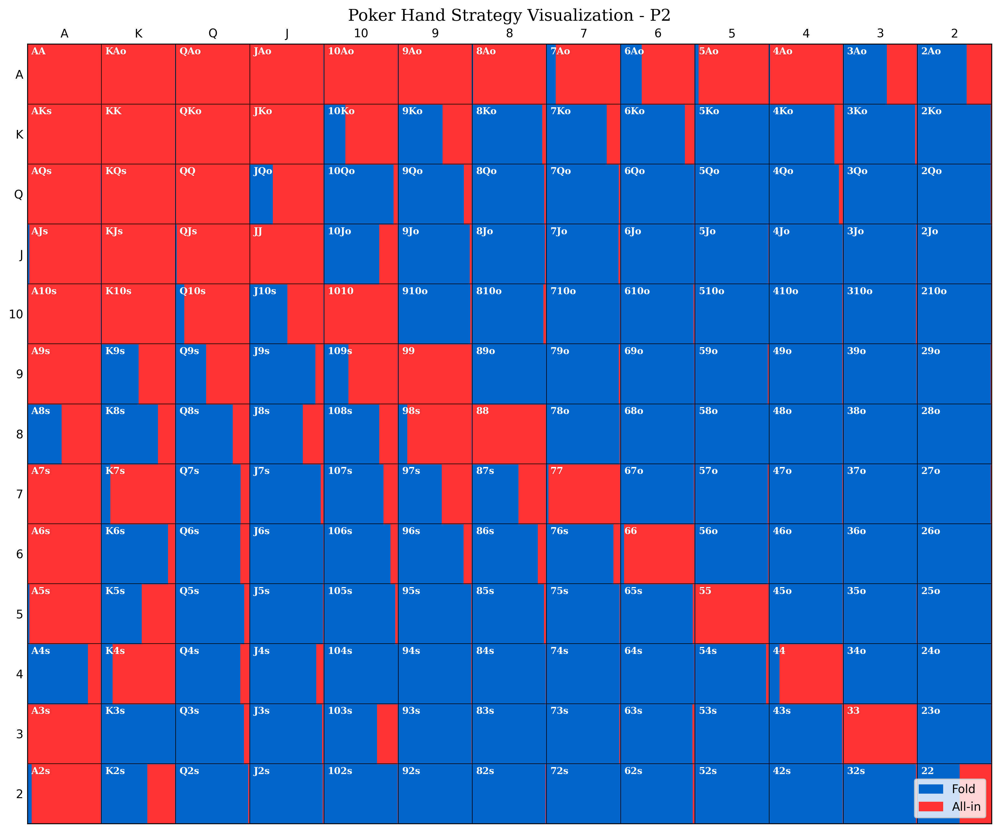

# All-or-Fold MCCFR

A high-performance implementation of Monte Carlo Counterfactual Regret Minimization (MCCFR) for All-or-Fold poker, written in modern C++17.

## Overview

All-or-Fold (AoF) is a simplified poker variant where players can only fold or go all-in with their remaining chips. This implementation uses the MCCFR algorithm to learn Game Theory Optimal (GTO) strategies through self-play.

### Features

- **Modern C++17**: Clean, efficient, and maintainable code
- **MCCFR Algorithm**: State-of-the-art regret minimization for strategy learning
- **Modular Design**: Separate game engine and algorithm components
- **Comprehensive Testing**: Unit tests for all major components
- **Performance Optimized**: Efficient memory usage and fast training
- **Configurable**: Support for different stakes and game parameters
- **Cross-platform**: Works on Linux, macOS, and Windows

## Quick Start

### Prerequisites

- C++17 compatible compiler (GCC 7+, Clang 5+, MSVC 2017+)
- CMake 3.14 or later
- Git

### Building

```bash
git clone https://github.com/yourusername/AoF_mccfr.git
cd AoF_mccfr
mkdir build && cd build
cmake ..
make -j$(nproc)
```

### Running

```bash
# Basic training with default settings (1M iterations)
./bin/aof_mccfr

# Train for 5M iterations
./bin/aof_mccfr --iterations 5000000

# Custom stakes (10c/20c)
./bin/aof_mccfr --small-blind 0.1 --big-blind 0.2

# Quiet mode with custom output
./bin/aof_mccfr --quiet --output my_strategy
```

## Game Rules

All-or-Fold poker is played with:
- **4 players** at the table
- **8 big blinds** starting stack for each player
- **2 hole cards** per player
- **5 community cards** (dealt at showdown)
- **3 actions**: FOLD, ALL_IN, or DEAL (chance node)

Players act in order after the blinds are posted. The game ends when either:
1. Only one player remains (others folded)
2. All remaining players are all-in

## Architecture

```
aof_mccfr/
├── include/                 # Public headers
│   ├── aof/                # Game engine
│   │   ├── types.hpp       # Common types and enums
│   │   ├── game_config.hpp # Configuration and constants
│   │   ├── card.hpp        # Card and deck management
│   │   ├── poker_evaluator.hpp # Hand evaluation
│   │   ├── game_state.hpp  # Game state representation
│   │   └── game.hpp        # Main game class
│   └── mccfr/              # MCCFR algorithm
│       ├── node.hpp        # Information set nodes
│       ├── trainer.hpp     # Main training algorithm
│       ├── strategy_manager.hpp # Strategy I/O
│       └── utils.hpp       # Utility functions
├── src/                    # Implementation files
├── tests/                  # Unit tests
├── examples/               # Example programs
└── docs/                   # Documentation
```

## API Usage

### Basic Training

```cpp
#include "aof/game.hpp"
#include "mccfr/trainer.hpp"

// Create game
aof::Game game(0.4, 1.0);  // 40c/80c blinds

// Create trainer
mccfr::Trainer trainer(game);

// Configure training
mccfr::TrainingConfig config;
config.iterations = 1000000;
config.enableProgressOutput = true;

// Train
auto utilities = trainer.train(config);

// Save strategies
trainer.saveStrategies("my_strategy.txt");
```

### Strategy Analysis

```cpp
// Load trained strategies
mccfr::StrategyManager manager;
manager.loadFromFile("strategy.txt");

// Get strategy for specific situation
std::string infoSet = "P0:[P1:A][P2:F][P3:P]AKs Pot:15.2";
auto strategy = manager.getStrategy(infoSet);

// Analyze strategies
auto stats = manager.getStats();
std::cout << "Total information sets: " << stats.totalInfoSets << std::endl;
```

## Algorithm Details

The MCCFR algorithm learns optimal strategies by:

1. **Sampling game trees** through Monte Carlo simulation
2. **Computing counterfactual regrets** for each decision point
3. **Updating strategies** using regret matching
4. **Averaging strategies** over time for convergence

### Information Set Abstraction

To reduce complexity, the algorithm uses card abstraction:
- **Hole cards** are abstracted by rank and suited/offsuit
- **Position-dependent** action histories
- **Pot size** information for betting context

## Performance

Typical performance on modern hardware:
- **Training speed**: ~10,000-50,000 iterations/second
- **Memory usage**: ~100MB-1GB depending on iterations
- **Convergence**: Good strategies after 1M+ iterations

## Testing

Run the test suite:

```bash
cd build
make test
# or
./run_tests
```

Tests cover:
- Card and deck operations
- Poker hand evaluation
- Game state transitions
- MCCFR algorithm correctness

## Examples

### Basic Training
```bash
./examples/basic_training
```

### Strategy Analysis
```bash
./examples/strategy_analysis strategy_file.txt
```

### Strategy Visualization
```bash
# Generate visualization from trained strategy
python visualizer.py build/strategy_2025_08_24_19_55_55.txt --position P2 --output my_strategy.png
```

## Contributing

1. Fork the repository
2. Create a feature branch (`git checkout -b feature/amazing-feature`)
3. Make your changes
4. Add tests for new functionality
5. Ensure all tests pass (`make test`)
6. Commit your changes (`git commit -am 'Add amazing feature'`)
7. Push to the branch (`git push origin feature/amazing-feature`)
8. Open a Pull Request

### Code Style

- Follow modern C++17 best practices
- Use `clang-format` for consistent formatting
- Add Doxygen comments for public APIs
- Write unit tests for new features

## License

This project is licensed under the MIT License - see the [LICENSE](LICENSE) file for details.

## Acknowledgments

- **Monte Carlo Counterfactual Regret Minimization** algorithm by Lanctot et al.
- **Counterfactual Regret Minimization** by Zinkevich et al.
- Modern C++ design patterns and best practices

## Citation

If you use this software in academic research, please cite:

```bibtex
@software{aof_mccfr,
  title={All-or-Fold MCCFR: High-Performance Game Theory Optimal Poker Training},
  author={Zakaria El Jaafari},
  year={2025},
  url={https://github.com/nier2kirito/AoF_mccfr}
}
```
## Strategy Visualization

The project includes a powerful Python visualizer that creates GTO Wizard-style poker hand range charts from trained MCCFR strategies. This tool helps analyze and understand the learned strategies visually.



*Example visualization showing Player 2's optimal strategy with fold (blue) and all-in (red) probabilities for each hand*

### How the Visualizer Works

The `visualizer.py` script parses MCCFR strategy files and creates professional poker hand range charts that display the optimal play frequencies for each possible starting hand. Here's how it works:

#### 1. **Strategy File Parsing**
- Reads MCCFR output files containing information sets and their corresponding strategies
- Extracts hand information, position data, pot sizes, and action probabilities
- Parses complex information set strings like `P2:[P0:P][P1:P]75o Pot:1.4 Visits: 1885`

#### 2. **Hand Range Matrix Creation**
- Maps poker hands to a 13×13 matrix representing all possible starting hands
- **Diagonal**: Pocket pairs (AA, KK, QQ, etc.)
- **Above diagonal**: Suited hands (AKs, AQs, etc.)
- **Below diagonal**: Offsuit hands (AKo, AQo, etc.)

#### 3. **Visual Representation**
- Each cell shows fold probability (blue) and all-in probability (red)
- Width of each color represents the frequency of that action
- Hand labels are displayed in each cell for easy identification
- Professional styling with clear legends and axis labels

#### 4. **Position-Specific Analysis**
- Supports filtering by player position (P0, P1, P2, P3)
- Can generate charts for all positions simultaneously
- Accounts for positional differences in optimal play

### Using the Visualizer

#### Basic Usage
```bash
# Visualize strategy for the first available position
python visualizer.py build/strategy_2025_08_24_19_55_55.txt

# Visualize specific player position
python visualizer.py build/strategy_2025_08_24_19_55_55.txt --position P2

# Save to specific file
python visualizer.py build/strategy_2025_08_24_19_55_55.txt --position P2 --output strategy_P2_final.png
```

#### Advanced Usage
```bash
# Generate charts for all positions
python visualizer.py build/strategy_2025_08_24_19_55_55.txt --all-positions --output-dir charts/

# Multiple positions with custom naming
python visualizer.py build/strategy_2025_08_24_19_55_55.txt --all-positions --output strategy_analysis.png
```

#### Command Line Options
- `strategy_file`: Path to the MCCFR strategy output file
- `--position, -p`: Specific player position (P0, P1, P2, P3)
- `--output, -o`: Output PNG file path
- `--output-dir, -d`: Directory for multiple chart output
- `--all-positions, -a`: Generate charts for all positions

#### Prerequisites for Visualization
```bash
pip install matplotlib numpy
```

### Understanding the Charts

The generated charts follow poker industry standards:

- **Blue areas**: Fold frequency (higher = more likely to fold)
- **Red areas**: All-in frequency (higher = more likely to go all-in)
- **Cell width**: Proportional to action probability
- **Hand notation**: Standard poker hand notation (AKs = Ace-King suited, AKo = Ace-King offsuit)

The visualization helps identify:
- **Tight ranges**: Mostly blue (folding frequently)
- **Aggressive ranges**: Mostly red (all-in frequently)
- **Balanced strategies**: Mix of blue and red
- **Position-dependent adjustments**: Different strategies per position

## Support

- **Issues**: Report bugs and request features on [GitHub Issues](https://github.com/nier2kirito/AoF_mccfr/issues)
- **Discussions**: Join the conversation on [GitHub Discussions](https://github.com/nier2kirito/AoF_mccfr/discussions)
- **Email**: Contact the maintainers at zakariaeljaafari0@gmail.com
